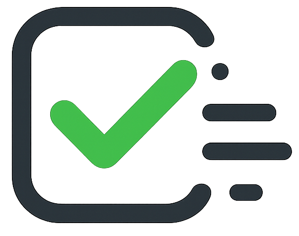

<p align="center">
  
</p>

<h1 align="center">Todogy</h1>

<p align="center">
  <strong>Fullstack todo app — guest mode + OAuth2 persistence</strong>
</p>

<p align="center">
  
  
  
  
  
  
  
  
</p>

---

## Features

- **Dual mode** — write tasks without an account (localStorage), log in to persist them server-side
- **OAuth2 authentication** — Google & GitHub login via Arctic
- **JWT with refresh rotation** — 15 min accessToken, 7-day refreshToken in httpOnly cookie, rotated on each refresh
- **Progress tracking** — circular progress dial + confetti at 100%
- **Guest→Auth merge** — local tasks sync to the backend on login
- **Responsive** — glassmorphism Orbit design, mobile-first

## Stack

| Layer | Technology |
|---|---|
| Frontend | Vue 3, TypeScript, Vite, Pinia, Vue Router, Tailwind CSS v4 |
| Backend | Hono, TypeScript, Mongoose, Arctic, bcryptjs |
| Database | MongoDB Atlas |
| CI/CD | Docker multi-stage, GitHub Actions, Render |

## Quick Start

```bash
git clone https://github.com/YaogoGerard/Todogy.git
cd Todogy

# Backend
cd backend
cp .env.example .env      # fill in your MongoDB & OAuth credentials
npm install
npm run dev                # → http://localhost:3000

# Frontend (new terminal)
cd frontend
npm install
npm run dev                # → http://localhost:5173
```

## Documentation

| Doc | What it covers |
|---|---|
| [01 — PRD](docs/01_prd.md) | Problem, users, use cases, out of scope |
| [02 — SRS](docs/02_srs.md) | Verifiable requirements (MUST / SHOULD / MAY) |
| [03 — System Contract](docs/03_system_contract.md) | Invariants, guarantees, forbidden actions |
| [04 — Req → Arch](docs/04_requirements_to_arch.md) | Responsibility map, component dependencies |
| [05 — Modeling](docs/05_modeling.md) | C4 diagrams, UML sequences |

## Project Structure

```
todogy/
├── backend/
│   └── src/
│       ├── config/           # env, constants
│       ├── modules/
│       │   ├── auth/         # register, login, OAuth, refresh, middleware
│       │   ├── todos/        # CRUD with ownership filter
│       │   └── users/        # Mongoose model
│       └── shared/database/  # MongoDB connection
├── frontend/
│   └── src/
│       ├── api/              # Axios instance, auth & todos endpoints
│       ├── stores/           # Pinia (auth, todos)
│       ├── views/            # TodosView, SignInView, SignUpView
│       └── components/       # NavBar
└── docs/                     # Engineering documentation
```

## Architecture

```
Vue 3 SPA ◄──HTTP/JSON──► Hono API ◄──Mongoose──► MongoDB Atlas
                              │
                    ┌─────────┴─────────┐
                Google OAuth        GitHub OAuth
```

## Contributing

See [CONTRIBUTING.md](CONTRIBUTING.md) for how to get started. PRs are welcome!

## License

[MIT](LICENSE)
