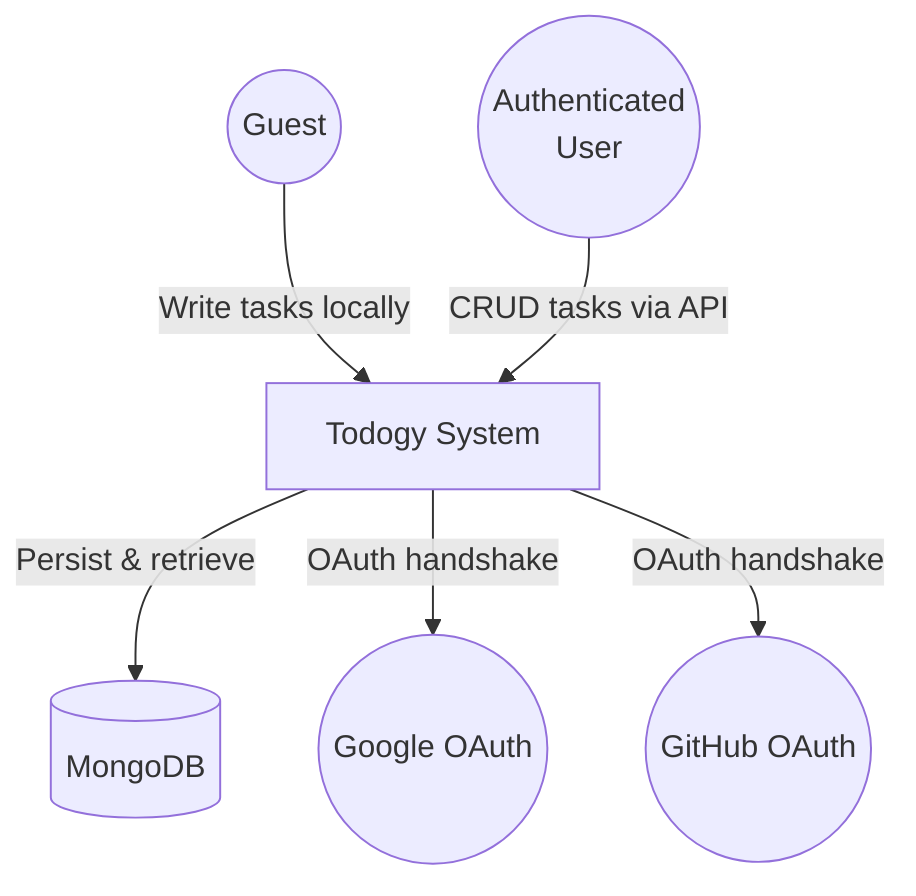

# Todogy — SRS (Software Requirements Specification)

> **What must the system guarantee, exactly, without describing how?**

---

## 1. Actors

---

## 2. Functional Requirements

### 2.1 Task Management (Guest Mode)

| ID | Requirement | Priority |
|---|---|---|
| F01 | The system **MUST** allow a guest to create a task by entering a title | MUST |
| F02 | The system **MUST** persist guest tasks in localStorage | MUST |
| F03 | The system **MUST** allow a guest to mark a task as completed | MUST |
| F04 | The system **MUST** allow a guest to delete a task | MUST |
| F05 | The system **MUST** show a progress indicator of completed vs total tasks | MUST |
| F06 | The system **MUST** filter tasks by "all", "active", or "done" | MUST |
| F07 | The system **MUST** allow empty state display when no tasks exist | MUST |

### 2.2 Authentication

| ID | Requirement | Priority |
|---|---|---|
| A01 | The system **MUST** allow a user to register with name, email, and password | MUST |
| A02 | The system **MUST** allow a user to log in with email and password | MUST |
| A03 | The system **MUST** allow a user to log in via Google OAuth | SHOULD |
| A04 | The system **MUST** allow a user to log in via GitHub OAuth | SHOULD |
| A05 | The system **MUST** issue a JWT accessToken (15 min expiry) on successful auth | MUST |
| A06 | The system **MUST** issue a refreshToken (7 day expiry) stored in an httpOnly cookie | MUST |
| A07 | The system **MUST** rotate the refreshToken on each refresh request | MUST |
| A08 | The system **MUST** invalidate the refreshToken on logout | MUST |

### 2.3 Task Management (Authenticated Mode)

| ID | Requirement | Priority |
|---|---|---|
| T01 | The system **MUST** list all tasks belonging to the authenticated user | MUST |
| T02 | The system **MUST** create a new task linked to the authenticated user | MUST |
| T03 | The system **MUST** update a task's completed status | MUST |
| T04 | The system **MUST** delete a task belonging to the authenticated user | MUST |
| T05 | The system **MUST** reject any operation on a task that does not belong to the user | MUST |
| T06 | The system **MUST** merge local (guest) tasks with API tasks on login | SHOULD |

### 2.4 Frontend UX

| ID | Requirement | Priority |
|---|---|---|
| U01 | The system **MUST** redirect unauthenticated users to the sign-in page only when accessing protected routes | MUST |
| U02 | The system **MUST** automatically refresh the accessToken on 401 responses | MUST |
| U03 | The system **MUST** display a confetti animation when all tasks are completed | MAY |

---

## 3. Non-Functional Constraints

| ID | Constraint | Value |
|---|---|---|
| N01 | The API **MUST** respond within 500ms for 95% of requests | Performance |
| N02 | The backend **MUST** run on Node.js (Hono framework) | Technology |
| N03 | The frontend **MUST** run on Vue 3 + Vite | Technology |
| N04 | The database **MUST** be MongoDB | Technology |
| N05 | Passwords **MUST** be hashed with bcryptjs | Security |
| N06 | The refreshToken cookie **MUST** be HttpOnly, Secure, SameSite=Strict | Security |
| N07 | Guest data **MUST NOT** be transmitted to the backend | Privacy |

---

## 4. Error Cases

| Scenario | Expected Response |
|---|---|
| Invalid email/password | HTTP 401, `{ "error": "Invalid credentials" }` |
| Expired accessToken | HTTP 401 → auto-refresh via interceptor |
| Invalid/expired refreshToken | HTTP 401 → redirect to `/signin` |
| Duplicate email on register | HTTP 500 (generic message) |
| Task not found or not owned | HTTP 404 |
| Missing auth header | HTTP 401 |
| MongoDB connection failure | Server crash on startup |
