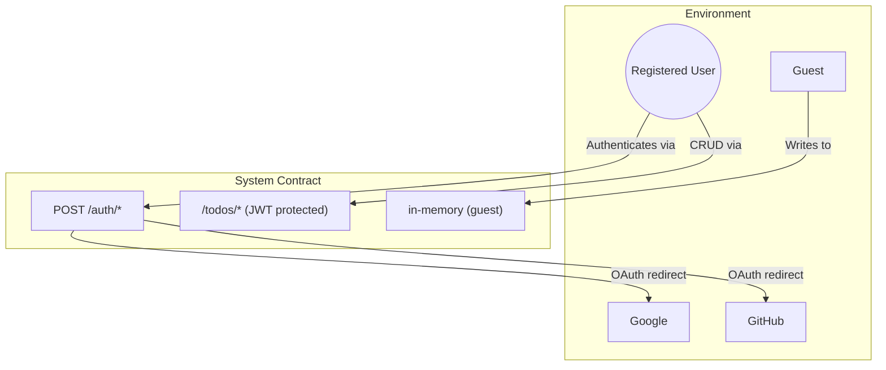

# Todogy — System Contract & Invariants

> **What the system promises, guarantees, and forbids.**

---

## 1. Actors & Interactions

```mermaid
graph TD
    subgraph Environment
        Guest
        User((Registered User))
        Google
        GitHub
    end

    subgraph "System Contract"
        AuthAPI["POST /auth/*"]
        TodosAPI["/todos/* (JWT protected)"]
        Memory["in-memory (guest)"]
    end

    Guest -->|Writes to| Memory
    User -->|Authenticates via| AuthAPI
    User -->|CRUD via| TodosAPI
    AuthAPI -->|OAuth redirect| Google
    AuthAPI -->|OAuth redirect| GitHub
```

---

## 2. Promises (Guarantees)

| Guarantee | Detail |
|---|---|
| **Guest autonomy** | Any person can create, complete, and delete tasks without authentication |
| **Guest data privacy** | Guest tasks never leave the browser and are kept only for the current session |
| **Auth persistence** | After login, backend tasks survive page refreshes and device switches |
| **Token rotation** | Each refresh request invalidates the old refreshToken and issues a new one |
| **Token integrity** | Refresh tokens are signature- and expiry-verified before rotation |
| **Data ownership** | A user can only see and modify their own tasks |
| **Session end** | Logout destroys the refreshToken server-side and clears the client cookie |
| **Origin restriction** | CORS is restricted to the configured `FRONTEND_URL` |
| **Brute-force resistance** | Auth endpoints are rate limited per client IP |

---

## 3. Invariants (Rules That Must Never Break)

| ID | Invariant | Scope |
|---|---|---|
| I01 | A todo **MUST** belong to exactly one user | Database |
| I02 | A refreshToken **MUST** be unique across all users | Database |
| I03 | A refreshToken **MUST NOT** be usable after rotation | Backend logic |
| I04 | A refreshToken **MUST NOT** be usable after logout | Backend logic |
| I05 | Email uniqueness is scoped per identity: one password account per email; OAuth accounts are unique per provider id | Database |
| I06 | Guest local tasks **MUST** be retained within the current session | Frontend |
| I07 | The accessToken **MUST** expire after 15 minutes | JWT claim |

---

## 4. Forbidden Actions

| Action | Reason | Response |
|---|---|---|
| Deleting another user's todo | Data integrity violation | HTTP 404 |
| Accessing todos without a valid JWT | Authentication bypass | HTTP 401 |
| Reusing a rotated refreshToken | Session hijacking prevention | HTTP 401 |
| Registering with an existing email | Identity collision | HTTP 409 |
| Sending malformed or oversized payloads | Invalid input | HTTP 400 |
| Exceeding the rate limit on auth endpoints | Brute-force prevention | HTTP 429 |
| Exceeding 80 characters per task title | UX consistency | Trimmed client-side |

---

## 5. Technical Constraints

| Constraint | Imposed by | Impact |
|---|---|---|
| Node.js runtime | Project stack | Backend must be Node-compatible |
| MongoDB Atlas | Hosted database | Network latency, connection pooling |
| Hono framework | Project stack | Serverless-compatible, lightweight |
| Render (free tier) | Hosting | Service sleeps after 15 min idle |
| localStorage (5MB limit) | Browser API | Guest storage limit |
