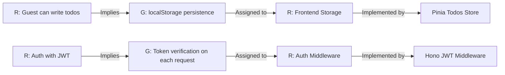
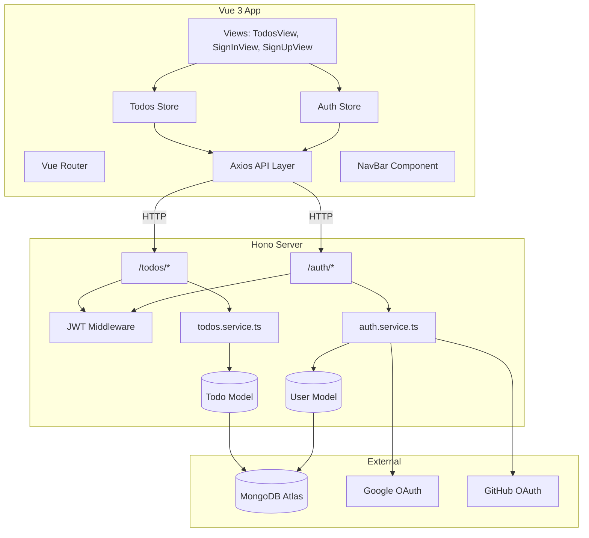

# Todogy — From Requirement to Architecture

> **Assigning responsibilities: who carries each guarantee?**

---

## 1. The Thread: Requirement → Guarantee → Responsibility → Component

---

## 2. Responsibility Map

| Requirement | Guarantee | Responsibility | Component | Module |
|---|---|---|---|---|
| Guest creates todo | Task captured in localStorage | Manage local CRUD + persistence | `useTodosStore` (`localStorage`) | Frontend Store |
| Guest marks done | Task toggled in localStorage | Update local state + save | `useTodosStore` | Frontend Store |
| User registers | Account created, tokens issued | Validate input, hash password, store user | `auth.service.ts` | `modules/auth` |
| User logs in | Credentials verified | Compare bcrypt hash, generate JWTs | `auth.service.ts` | `modules/auth` |
| User logs in via Google | OAuth handshake + profile creation | Validate OAuth code, create/find user | `auth.service.ts` (googleLogin) | `modules/auth` |
| User logs in via GitHub | OAuth handshake + profile creation | Validate OAuth code, fetch GitHub profile | `auth.service.ts` (githubLogin) | `modules/auth` |
| AccessToken expires | Silent refresh via cookie | Intercept 401, call `/auth/refresh`, retry queue | Axios interceptor | Frontend API |
| RefreshToken rotates | Old token invalidated | Issue new pair, update DB | `auth.service.ts` (refreshAccessToken) | `modules/auth` |
| User lists todos | Return only owned tasks | Query `Todo.find({ userId })` | `todos.service.ts` | `modules/todos` |
| User creates todo | Task linked to userId | Create doc with `{ title, userId }` | `todos.service.ts` | `modules/todos` |
| User deletes todo | Only owner can delete | `findOneAndDelete({ _id, userId })` | `todos.service.ts` | `modules/todos` |
| Guest tasks merge on login | Local tasks pushed to backend | Read localStorage, POST each, then fetch | `useTodosStore` | Frontend Store |

---

## 3. Component Dependency Graph

---

## 4. Cohesion Analysis

| Module | Responsibilities | Cohesion |
|---|---|---|
| `modules/auth` | Register, login, OAuth, refresh, logout, JWT middleware | High — all token lifecycle |
| `modules/todos` | CRUD, ownership filtering | High — all task operations |
| `modules/users` | User schema, DB model | High — single concern |
| `shared/database` | MongoDB connection | High — single concern |
| Frontend Store | State + localStorage persistence | Medium — state + persistence mixed |
| Frontend API | HTTP layer + interceptor | High — all external communication |
