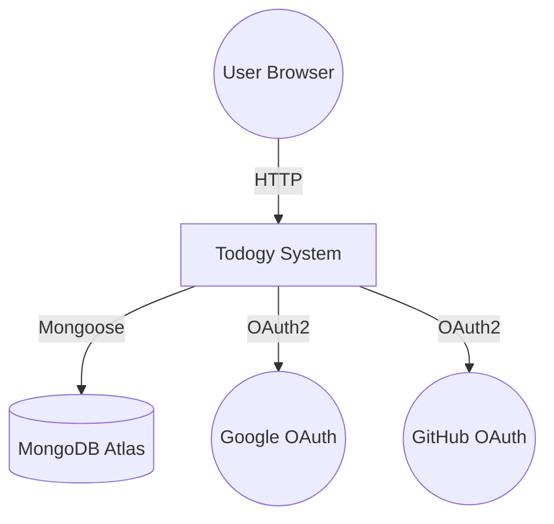
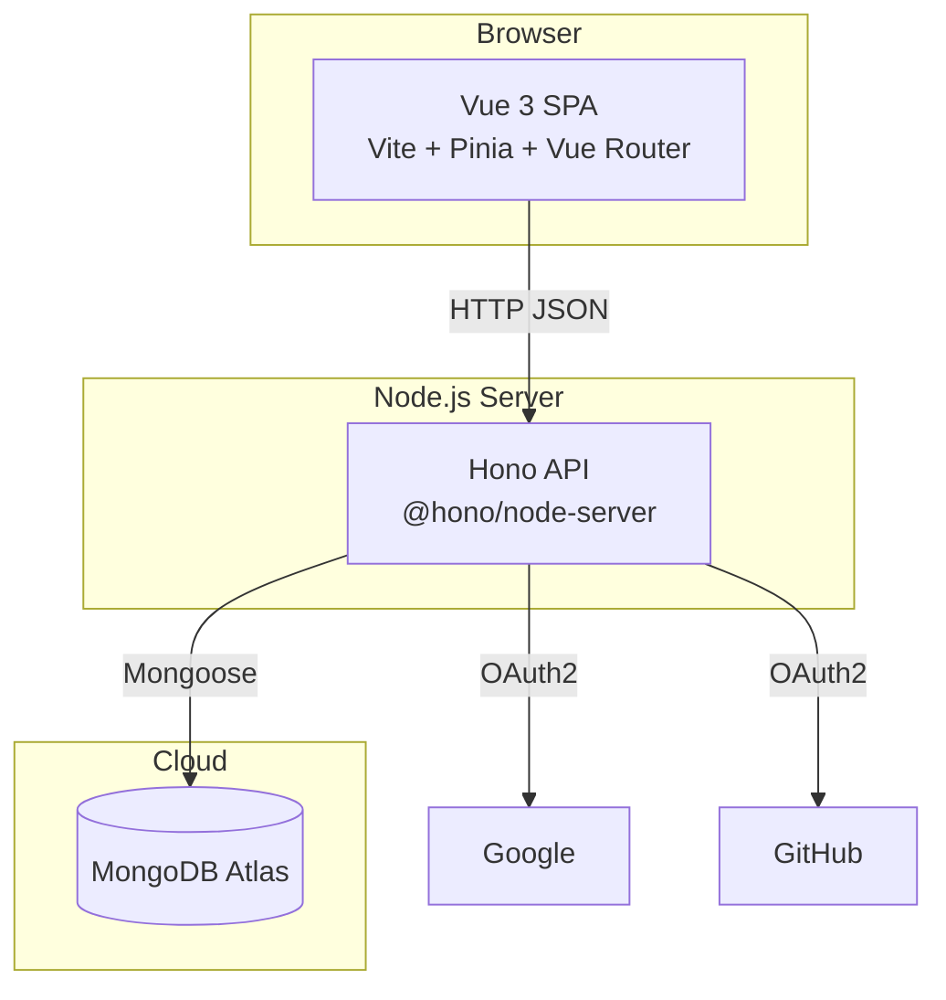
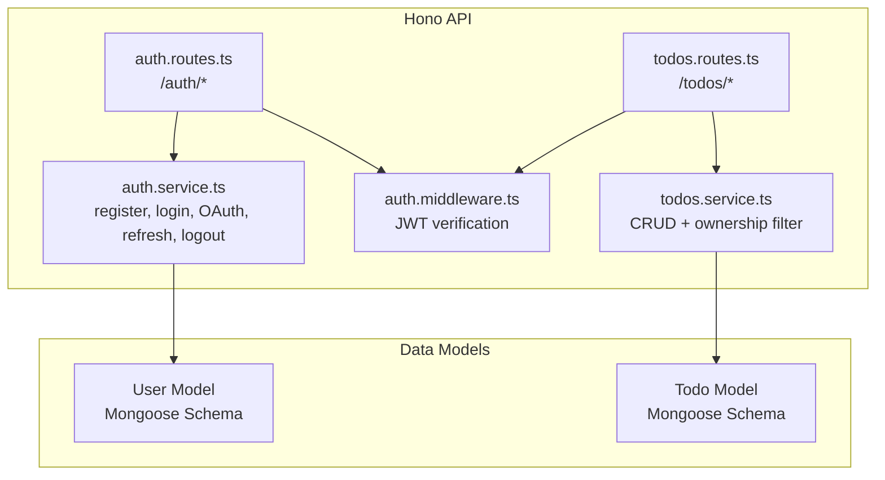
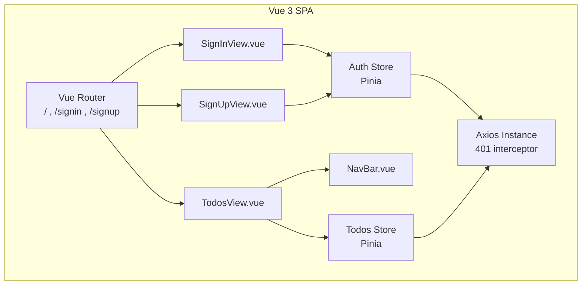
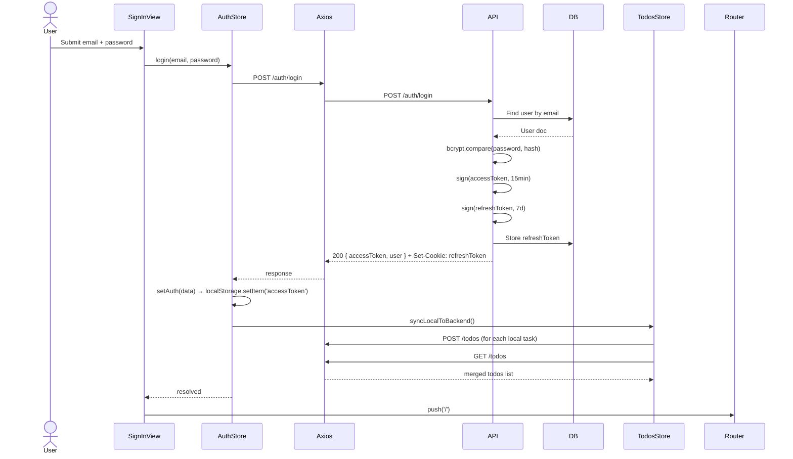
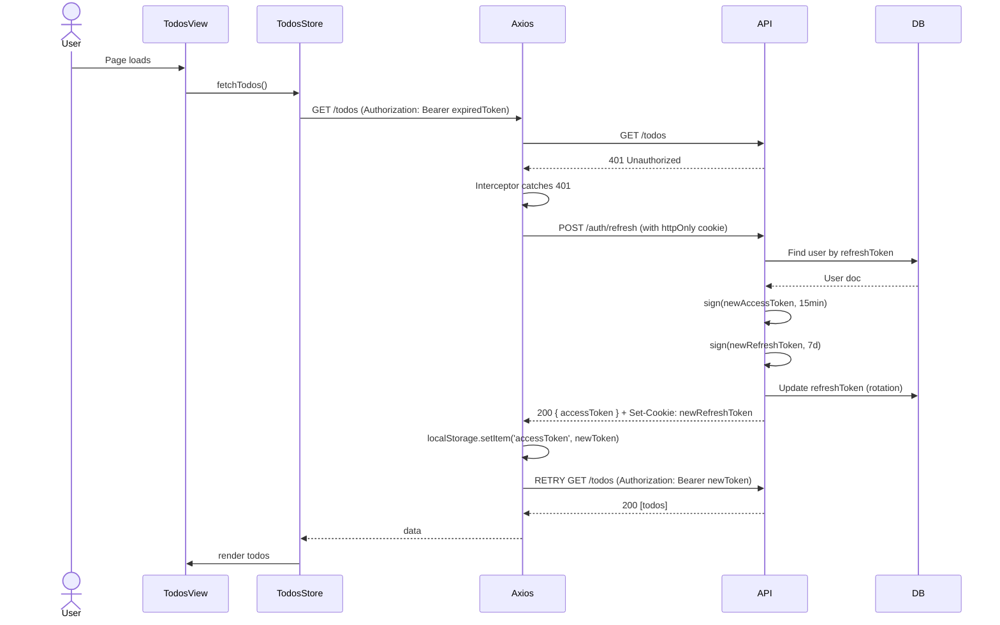
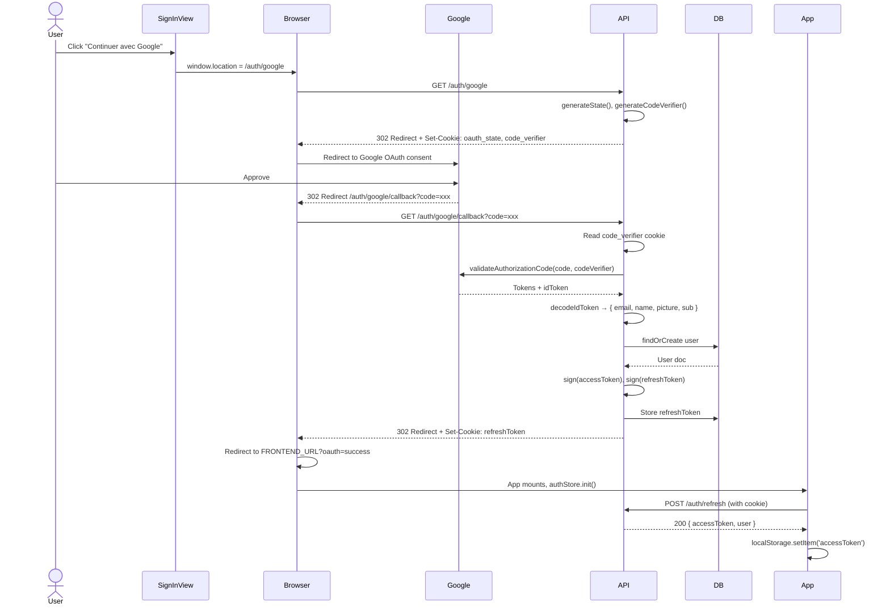

# Todogy — System Modeling (UML & C4)

> **Structure and behavior of the system.**

---

## 1. C4 — Context Diagram

| Element | Description |
|---|---|
| **User Browser** | Vue 3 SPA served via Vite dev server or static hosting |
| **Todogy System** | Hono API server + frontend (the system under design) |
| **MongoDB Atlas** | Cloud-hosted MongoDB, stores users and todos |
| **Google / GitHub OAuth** | External identity providers |

---

## 2. C4 — Container Diagram

| Container | Technology | Responsibility |
|---|---|---|
| **Vue 3 SPA** | Vue 3, TypeScript, Pinia, Vue Router, Tailwind CSS v4 | UI rendering, client state, localStorage persistence, Axios HTTP |
| **Hono API** | Hono, TypeScript, Mongoose, Arctic | Auth (JWT + OAuth), todos CRUD, request validation |
| **MongoDB Atlas** | MongoDB 7+ | Persistent storage for users and todos |

---

## 3. C4 — Component Diagram (Backend)

---

## 4. C4 — Component Diagram (Frontend)

---

## 5. UML — Sequence Diagram: Login Flow

---

## 6. UML — Sequence Diagram: AccessToken Refresh

---

## 7. UML — Sequence Diagram: OAuth Google Flow

